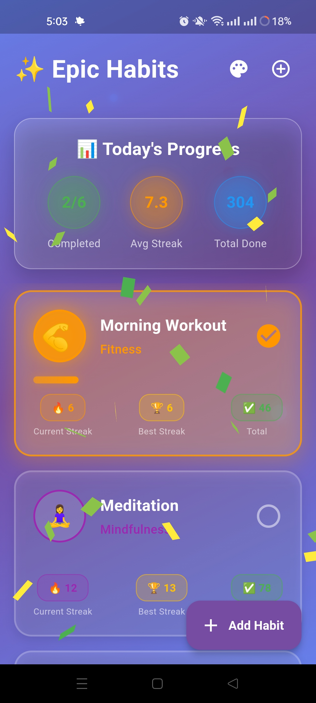
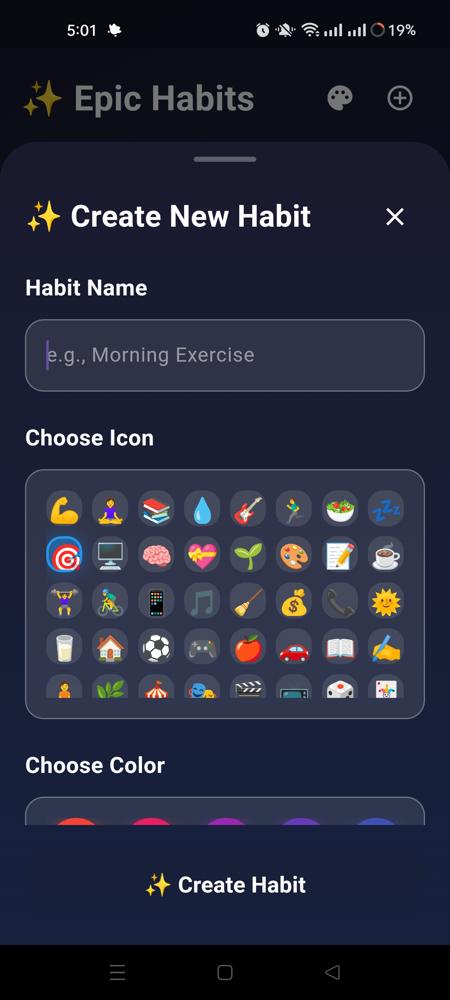
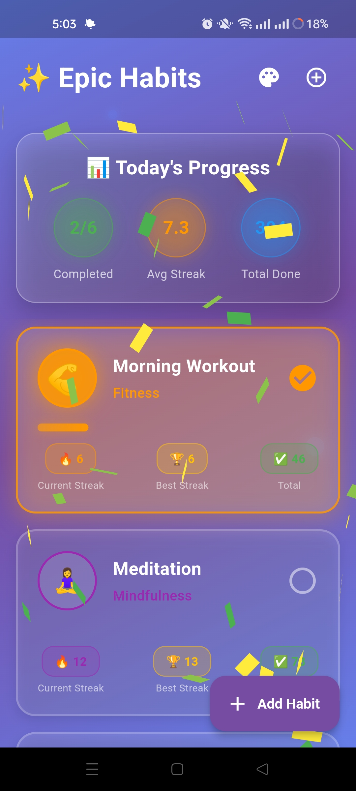
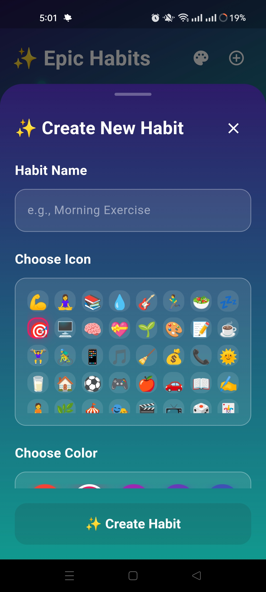

# 🎯 Flutter Habit Tracker

[](https://flutter.dev)
[](https://dart.dev)
[]()
[]()
[](https://opensource.org/)

---

## 🎨 Overview

**Flutter Habit Tracker** is a **vibrant and engaging Flutter application** that makes habit tracking exciting with **50+ emojis and colors**, **confetti celebrations**, and a **unique 5-level achievement system** — featuring dynamic animations, diamond explosions, and motivational rewards.

This project serves as a **comprehensive showcase** for developers exploring advanced Flutter animations, state management, and creating gamified user experiences that keep users motivated and engaged.

---

## 🎬 Preview

<div align="center">
  
  
  *Make habit tracking fun and rewarding*
  <video src="https://github.com/user-attachments/assets/e0864b8f-56ba-4b45-a062-bd88675faa50" controls width="100%" ></video>

    
</div>


---

## ✨ Features

### 🎯 **Habit Tracking**
* 📊 **Progress Tracking** — Monitor daily habit completion with visual feedback
* 🎨 **50+ Customization Options** — Choose from extensive emoji and color combinations
* ✅ **Easy Check-ins** — Quick tap to mark habits as complete

### 🎉 **Celebration System**
* 🎊 **5-Level Achievements** — Unique rewards for different milestones
* 🎆 **Confetti Explosions** — Celebrate completions with colorful animations

### 🎨 **Stunning UI Design**
* 🌈 **Vibrant Color Palette** — Eye-catching gradients and color schemes
* 🎭 **Emoji Integration** — Express habits with fun visual icons
* 📱 **Intuitive Interface** — User-friendly design with touch feedback

---

## 📸 Screenshots

<div align="left">
  <table>
    <tr>
      <td></td>
      <td></td>
      <td></td>
      <td></td>
    </tr>
  </table>
</div>

---

## 🎥 Demo Video

Watch the **Habit Tracker** in action:
<div align="center">
<video src="https://github.com/user-attachments/assets/your-demo-video-id" controls width="100%" ></video> 
</div>


---

## 🏗️ Tech Stack

| Technology                          | Description                                          |
| ----------------------------------- | ---------------------------------------------------- |
| **Flutter**                         | Cross-platform framework for building beautiful apps |
| **Dart**                            | Core programming language powering Flutter apps      |
| **confetti**                        | Package for confetti celebration animations          |
| **flutter_animate**                 | Advanced animation library for smooth transitions    |

---

## ⚙️ Installation & Setup

Follow these steps to run the project locally:

### 1️⃣ Clone the Repository

```bash
git clone https://github.com/<your-username>/flutter-habit-tracker.git
cd flutter-habit-tracker
```

### 2️⃣ Install Dependencies

```bash
flutter pub get
```

### 3️⃣ Run the App

```bash
flutter run
```

---

## 💡 Learning Outcomes

By working with this project, you'll gain insights into:

* 🎨 **Gamification Design** — Creating engaging and motivational user experiences
* 🎉 **Advanced Animations** — Implementing confetti and celebration effects
* 📊 **State Management** — Tracking and persisting habit data
* 🎯 **Achievement Systems** — Building milestone-based reward mechanics
* ✨ **Custom Animations** — Using flutter_animate for smooth transitions


---

## 🤝 Contributing

Contributions are encouraged! If you'd like to enhance the design or functionality:

1. Fork the repository
2. Create a new branch (`git checkout -b feature/your-feature`)
3. Commit your changes (`git commit -m 'Add a new feature'`)
4. Push to the branch (`git push origin feature/your-feature`)
5. Open a Pull Request

---
🧠 Flutter Development Environment Setup

This project is built using Flutter. Below are the essential details and configuration requirements for replicating the development environment.

| Component              | Details                                      |
| ---------------------- | -------------------------------------------- |
| **Flutter Version**    | 3.27.1 (Stable Channel)                      |
| **Framework Revision** | 17025dd882                                   |
| **Engine Revision**    | cb4b5fff73                                   |
| **Dart Version**       | 3.6.0                                        |
| **DevTools Version**   | 2.40.2                                       |
| **Operating System**   | Windows 10 (Version 10.0.26200.6725, 64-bit) |
| **Locale**             | en-US                                        |


💻 Android Studio

* Version: 2023.3
* Java Runtime: OpenJDK 17 (17.0.10+0--11572160)

---

## 🤝 Contributing

Contributions are highly encouraged! Here's how you can help:

1. 🍴 **Fork** the repository
2. 🌿 **Create** a new branch (`git checkout -b feature/amazing-feature`)
3. 💾 **Commit** your changes (`git commit -m 'Add amazing feature'`)
4. 📤 **Push** to the branch (`git push origin feature/amazing-feature`)
5. 🎉 **Open** a Pull Request

---

## 💬 Connect & Support

For questions, feedback, or collaborations:

<div align="center">

[](https://github.com/PHom798)
[](https://x.com/KishanP07684084)
[](https://www.linkedin.com/in/hom-bdr-pathak-01a3bb210)
[](pathakhom17@gmail.com)

</div>

---

## 🌟 Show Your Support

If this project helped you or inspired your work:

<div align="center">

⭐ **Star this repository**  
🍴 **Fork it for your projects**  
📢 **Share with the Flutter community**  
💖 **Sponsor the development**  
🐛 **Report issues or suggest features**

</div>

---

## 📊 Project Stats

<div align="center">


</div>

---

<div align="center">

**Made with ❤️, Flutter, and 🎯**

*Making habits stick with celebration and fun*

### 🎯 *"Track, Celebrate, Succeed"* 🎉

</div>
